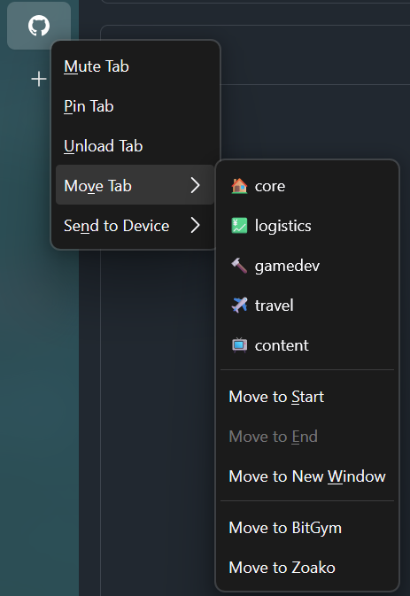

# Customized Zen Context Menu mod

[Original repository source](https://github.com/KiKaraage/ZenMods/tree/a6552b9ab17829d052832cdc091e3b19fa716616/Zen-context-menu)
[Original mod source](https://github.com/zen-browser/theme-store/tree/65a35f2fe25ce175f8fab0d21934f52916419a97/themes/81fcd6b3-f014-4796-988f-6c3cb3874db8)

This version makes a few opinionated cleanups. Here's what it looks like when I use it 
(I care about spaces and profiles, but not really most other tab context menu options):   

   

As of this commit, this theme isn't on the theme store.

To use this mod in your zen install:
- Check out this repo or extract the downloadable zip archive
- Move the folder inside your zen installations profile/chrome
    - Windows: `C:/Users/<user-folder>/AppData/Roaming/zen/Profiles/<profile-folder>/chrome/zen-themes/`
    - OSX: `~/Library/Application Support/zen/Profiles/<profile-folder>/chrome/zen-themes/`